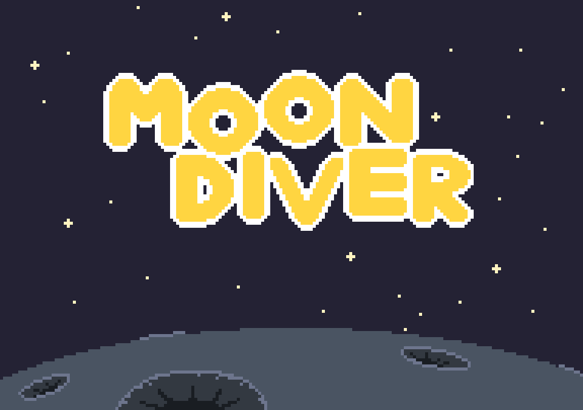

<!-- PROJECT LOGO -->
 

  
  <h3 align="center">Moon Diver</h3>
  <a href="https://chrisdkkuba.github.io/moon_diver/">Play Here!</a>

<!-- ABOUT THE PROJECT -->
## About The Project

A short 2d platformer developed for a university project.

### Built With

* Vanilla JS
* HTML, CSS

<!-- LICENSE -->
## License

Distributed under the MIT License. See `LICENSE.txt` for more information.

<!-- CONTACT -->
## Contact

Christof Kuba - christof.kuba@gmail.com

Project Link: [https://github.com/chrisDKkuba/moon_diver](https://github.com/chrisDKkuba/moon_diver)

<!-- ACKNOWLEDGMENTS -->
## Acknowledgments

* [GitHub Pages](https://pages.github.com)